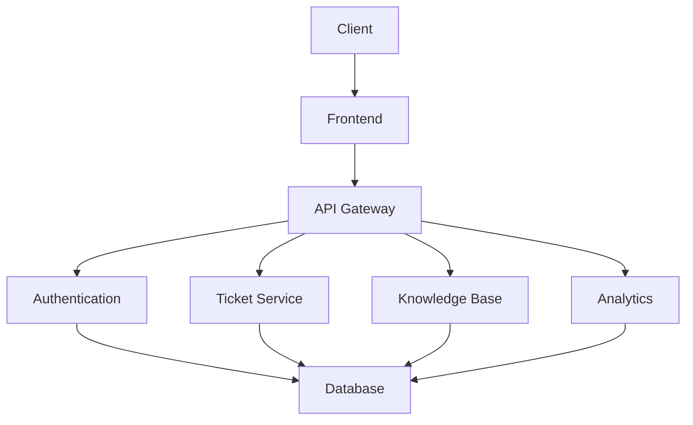

# Technical Support System

## 🔹 Project Title & Topic
A modern technical support system designed to streamline customer service operations and improve response times. This system provides an integrated platform for managing support tickets, customer interactions, and knowledge base articles.

## 🔹 Expected Results
- Efficient ticket management and routing
- Improved response times through automated workflows
- Better customer satisfaction through organized support processes
- Reduced resolution time through knowledge base integration
- Analytics and reporting for support team performance

## 🔹 Technical Details
- **Programming Language**: Python 3.9+
- **Web Framework**: FastAPI
- **Database**: MySQL
- **Frontend**: React with TypeScript
- **Authentication**: JWT
- **Containerization**: Docker
- **OS Requirements**: Linux/macOS/Windows
- **Dependencies**: See requirements.txt

## 🔹 Code Style
This project follows PEP 8 style guide for Python code and ESLint with Airbnb style guide for TypeScript/JavaScript code. All code should be properly formatted and documented.

### Linter and Static Analysis Tool Justification
- **Black**: Used for automatic code formatting. Black enforces a consistent code style and is widely adopted in the Python community. It may allow lines longer than 79 characters for readability, which is a common modern practice.
- **flake8**: Used for code linting and style checking. flake8 enforces PEP 8 compliance and helps catch common style issues and potential bugs. Some line length warnings (E501) may be ignored in favor of Black's formatting.
- **mypy**: Used for static type checking. mypy helps catch type-related bugs early and enforces type annotations, improving code quality and maintainability.

All three tools are integrated into the CI workflow and reports are saved in the `static_analysis/` directory.

## 🔹 How to Run
1. Clone the repository:
```bash
git clone https://github.com/matthew-solid/technical-support.git
cd technical-support
```

2. Set up the development environment:
```bash
# Create and activate virtual environment
python -m venv venv
source venv/bin/activate  # On Windows: venv\Scripts\activate

# Install dependencies
pip install -r requirements.txt

# Set up the database
python scripts/setup_db.py

# Run the application
python main.py
```

3. Access the application:
- Frontend: http://localhost:3000
- API Documentation: http://localhost:8000/docs

## 🔹 Key Functionality
- Ticket Management System
- Real-time Chat Support
- Knowledge Base Integration
- Automated Ticket Routing
- Performance Analytics
- User Authentication & Authorization
- API Integration Capabilities

## 🔹 Visuals/Screenshots

*System Architecture Diagram*

## 🔹 Project Structure


## 🔹 Contacts
- GitHub: [Your GitHub Profile]
- Email: [Your Email]

## 🔹 License
This project is licensed under the MIT License - see the [LICENSE](LICENSE) file for details. 