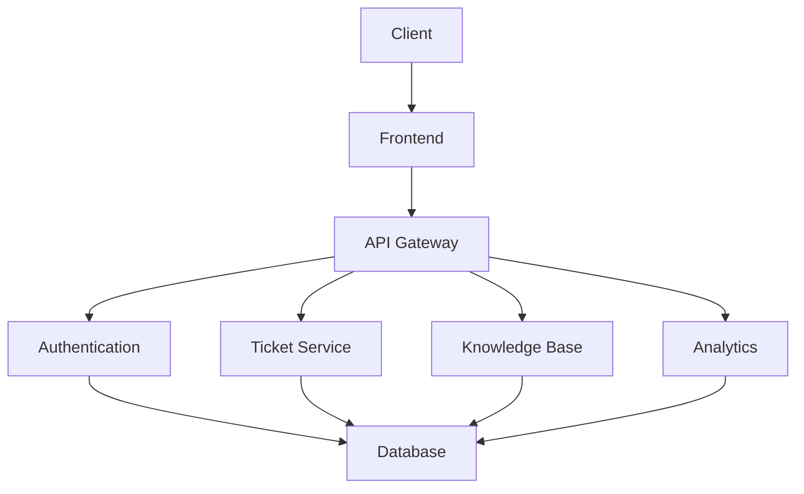

# Technical Support System

A modern technical support system designed to streamline customer service operations and improve response times.

## Key Features

- Ticket Management System
- Real-time Chat Support
- Knowledge Base Integration
- Automated Ticket Routing
- Performance Analytics
- User Authentication & Authorization
- API Integration Capabilities

## Quick Start

1. Clone the repository:
```bash
git clone https://github.com/matthew-solid/technical-support.git
cd technical-support
```

2. Set up the development environment:
```bash
# Create and activate virtual environment
python -m venv venv
source venv/bin/activate  # On Windows: venv\Scripts\activate

# Install dependencies
pip install -r requirements.txt

# Set up the database
python scripts/setup_db.py

# Run the application
python main.py
```

3. Access the application:
- Frontend: http://localhost:3000
- API Documentation: http://localhost:8000/docs

## System Architecture



## Documentation

For more detailed information, please visit our [GitHub repository](https://github.com/matthew-solid/technical-support). 